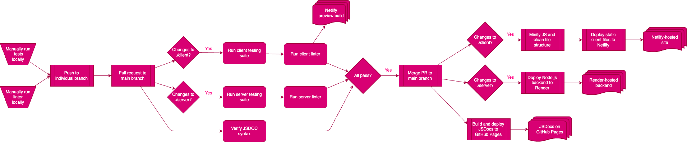

# CI Pipeline

Since we are using a monorepo, colocating both our client- and server-side code, we require a multifaceted deployment pipeline. The pipeline is run primarily through GitHub Actions.

## Structure
Our `main` branch is protected. During any pull request to `main`, a series of checks will be run as appropriate, depending principally on where any changes exist in the subdirectory structure. On merge, deployment of each of the artifacts will be executed.

### Pre-commit
Developers can, and should, verify their own changes in accordance with the instructions in [CONTRIBUTING.md](/CONTRIBUTING.md). Namely, the testing suites in the `/client` and `/server` subdirectories can both be run with `npm run test`; similarly, linting can be checked with `npm run lint`. If there are automatically-fixable linting errors or warnings (e.g., from Prettier), they can be remedied with `npm run lint:fix`. 

_Currently, JSDocs issues will be reported as warnings instead of errors. This means that they do **not** need to be fixed in order to merge a pull request. In the future, this will change. As such, you should add and fix JSDocs comments on all files you edit to mitigate any future burden._

### On pull request
When a new pull request is triggered, GitHub actions will check if there are changes to either/both of the `/client` and `/server` subdirectories. In any with changes, a script will run the testing suite and linter. Any errors will report back as failures. 

Netlify will automatically generate and attach a preview build to your pull request. This will allow you to view any changes as they would appear in the production environment before you merge the branch. Please make sure that your changes appear as you would expect them to. _Note: If you simultaneously made changes to both the server and client, the server changes will not be reflected in the preview build; the preview build will be attached to the current production deployment of the server due to pricing constraints from Render._

**All steps must be passed in order to merge your branch into `main`.**

### On merge
When a branch is merged into main, there are three deployment processes which simulatenously may commence. If there were not appropriate changes to targeted files, some processes may be skipped. 
- **JSDocs**: JSDocs will be deployed automatically to GitHub Pages.
- **`./client`**: The static client files will be deployed automatically to Netlify.
- **`./server`**: The Node.js WebSocket backend will be deployed automatically to Render.

### Artifacts
- JSDocs: [https://cse112-sp24-group12.github.io/cse112-sp24-group12/](https://cse112-sp24-group12.github.io/cse112-sp24-group12/)
- Client: [https://tarot-game-client.netlify.app/](https://tarot-game-client.netlify.app/)
- Server: [https://tarot-game-server.onrender.com](https://tarot-game-server.onrender.com)

## Details
We have both testing and linting suites. The infrastructure and rules for these suites are implemented identically in both `./client` and `./server`, although the files are placed in both locations (i.e., any changes should be made to _both_ files).

### Linting
We are using a combination of ESLint and Prettier through a plugin which allows ESLint to interpret Prettier results as errors before running its own processing (i.e., to report _where_ issues are occuring instead of just automatically fixing them as Prettier defaults to). We further installed a plugin which mandates JSDocs comments existence and formatting conformance. The linter can be run with `npm run lint`. Automatic fixes can be performed with `npm run lint:fix`.

### Testing
We are using Jest for testing. On the client, we are also using Puppeteer to run end-to-end testing through a headless browser instance. Each testing suite can be run with `npm run test`.

### JSDocs
We are using JSDocs to structure our block-level comments, and automatically generate external documentation.

## Other
### Code Climate
We also have Code Climate statically monitoring all code on our repo. This analysis will never block a pull request from merging, but should be activately monitored by all developers. A badge on the main README has been provided to allow more rapid analysis.