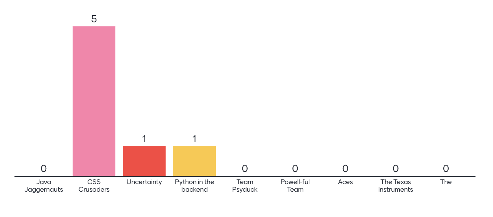
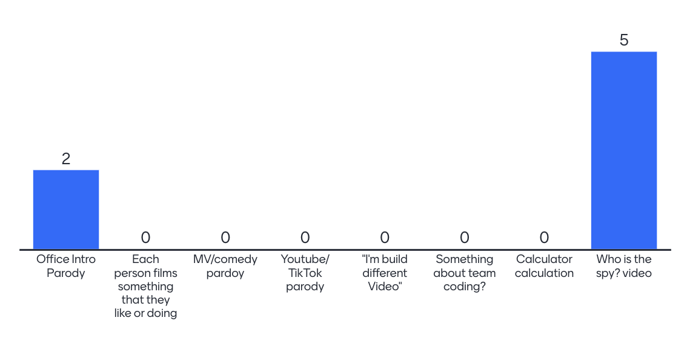

# Team Kick Off

## Opening 
**Team** : 17 (CSS Crusaders)  
**Type** : Team Meeting / Kick Off   
**Location** : Price Center  
**Time** : Monday, April 17th 2023, 3-5pm  
**Attendance**: 
- [x] Mick
- [x] Jenny
- [x] Kristine
- [x] Kevin
- [ ] Maryam (with notice)
- [x] Henry
- [x] Steven
- [x] Ben
- [x] Ziyou (James)
- [ ] Jeannie (with notice)

---
## Agenda

### From Last Meeting: 
- None

### For Today Meeting:
- [x] Bonding event
- [x] Team Branding 
- [x] Team Contract
- [x] Video
- [x] Magic 8 Ball Prototype
- [x] Logicstics
- [x] Questions and Concerns

---

## Details

### 1. Bonding Event 
- Vote on which activity to do -> Gartic Phone
- Took a picture -> Done

### 2. Team Branding 
- *Team Name*: CSS Crusaders

- *Color*: Orange
- *Mascot*: Crusader wearing a div tag

### 3. Team Contract 
- [Link](https://docs.google.com/document/d/1c5Ec3FUBPagZe1XYtCJUaSwS2Gx2s87AQGGZlbmexXE/edit?usp=share_link)
- Individual Assignment: sign a copy and add it to the Github
  
### 4. Video
- Present and vote on ideas: 

- Final: Who is the spy? 
  - Scenario: There was a spy who ate the cake last night. Each person will come up with an excuse of what they do last night. Each individual video should be around 7 seconds long and should include a phrase similar to "Last night, I was doing `something`"
  - Choose a spy - Mick -> Video with cream/crumbs on his face to show that he is the spy
- Video Editor - Kristin

### 5. Magic 8 Ball Prototype
- Ideas:
  - Categorical question and answering: For example, food and travel
  - 3D image/animation 
  - Make answers audio recording and play
  - Other means of fortune telling:
    - Bottle in the ocean
    - Fortune cookie (option to choose between multiple cookies?)
    - Thrown rice shape fortune telling
    - Book
    - Spin the wheel
  - User choose tones -> Example: sarcasm or aggressive
- Prototype
  - Graphics: Fortune Cookies
  - Use ChatGPT
  - Write tests and documentations
  - Scalable for mobile phone

### 6. Logistics
- Github Repo Intro
- Role
  - Divide in task so TBD
- Phone numbers:
  - `blank for private purpose`
- Team Page volunteer: Ben

---
## Questions
1. How is it different from hashmap randint() to return an answer?
   1. Can use hashmap to make categories

---
## Conclusion 

### To do before next meeting
- Sign and contract and github
- Upload your individual video (due Wed)
- If you are assigned any task, please also complete those

### What to do in next meeting 
- Sit together in class to see how prototype idea is sufficient/good -> if need to make big changes, we will have meeting Tuesday 7-8pm (prob on Zoom)
- Figure out prototype design 
- [When2Meet](https://www.when2meet.com/?19730026-kEplk)
   

