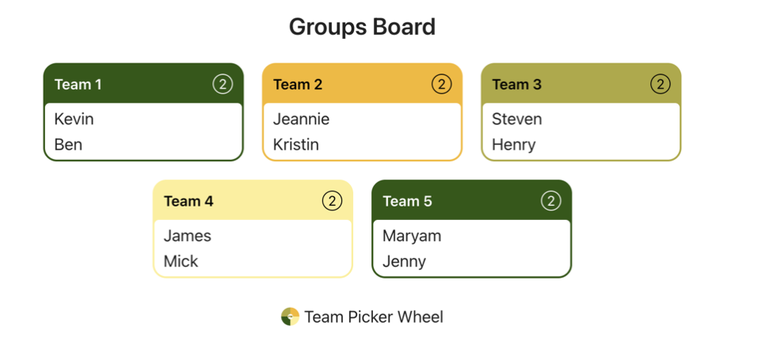
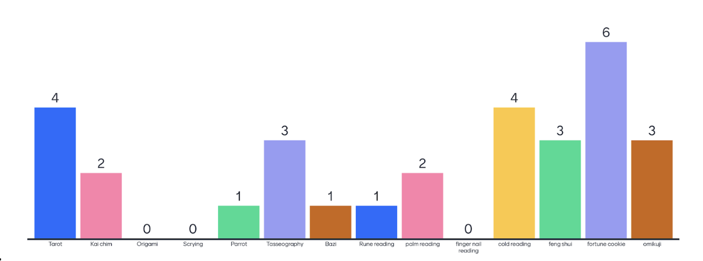
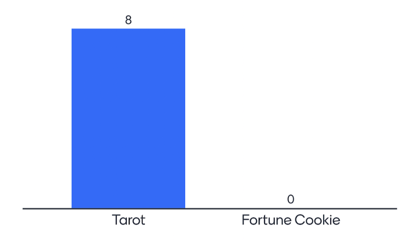

# Team Meeting and Check In With Akshay 

## Opening 
**Team** : 17 (CSS Crusaders)  
**Type** : Brain Storming   
**Location** : Zoom  
**Time** : Monday, May 1st 2023, 1:00 - 2:00pm  
**Attendance**: 
- [X] Mick
- [X] Jenny
- [X] Kevin
- [X] Maryam
- [X] Ben
- [X] Jeannie
- [X] Henry
- [X] Steven
- [X] James
- [X] Jeannie

---
## Agenda

### From Last Meeting: 
- Each members from brainstorming must have at least 2 ideas and have preparation to pitch their idea 

### For Today Meeting:
1. Ice breaker (5mins) - pass the popcorn
2. Lab 5 pair assignment (2mins)
3. Each team member have 2 mins max to talk about their ideas (~25mins)
4. Vote to choose 2-3 final ideas (5mins)
5. Use the point system (the rest)
    - FrontEnd, BackEnd, Doable(complexity), AI/ML, Usable

---

## Details
### 1.Ice Breaker 
  - Rule: Share your answer and appoint the next person!
  - Question: If you had to get rid of ONE condiment forever, what would it be?
### 2. Lab 5 Pairing 
  - https://pickerwheel.com/tools/random-team-generator/ 
  - 
### 3. Share your ideas!
- Order: Jenny, Kevin, Kristin, Jeannie, Ben, Maryam, Mick, Steven
1. Tarot
- camera integrated - take a picture of the user 
- and user it to generate a card of the user 
2. Kai Chim
- bamboo stick have words 
- shake until a stick falls out 
- ask and get an answer
3. Origami
- user put in prompt 
- website give you tutorial to how to fold origami 
- incorporate different themes 
4. Scrying
- Generate tarot card based on the user face and output image
- stable diffusion 
5. Parrot Astrology
- use parrot
- parrot moving animation
- card customization
6. Tasseography
- tea animation
- Question: associate shapes with the question 
- Not neccessarily correlated to input
7. Bazi
- Fortune based on birth date (YYMMDD + time) to generate 8 characters
- A lot of intepretation - maybe a difficulty
- good visual
8. Rune Reading
- similar to tarots cards 
- choose 1 or more runes
- combination to output
9.  Palm Reading
- submit picture/answer MC questions 
- categories of the palm 
- generate a list of bullet points
- feed it to ChatGPT to write a poem
10. Onychomancy
- kind of similar to palm reading but with fingernail
11. Cold Reading
- simple implementation
- prompt user to input user info
- dressing style -> drawing choices
- animation of someone making a prediction
- small predictions after each response (transition)
- maybe can have a user profile to save the information of the user
12.  Feng Shui
- scan the room
- voice output-visual impaired
- text output-hearing impaired
13.  Fortune Cookie
- restaurant experience 
14. Omikuji
- wikipedia has the fortune 
- css heavy 
- can make it visually better for 

### 4. Vote Results

### 5. Pitch Requirements
1. Statement of purpose
2. Section on user persona
3. Topics of risks and rabbit holes
4. Visual representation
  - diagram 
  - Wireframes
5. 16 pages max ppt or 8 pages document

---
## Questions

---
## Conclusion 
- Meet tomorrow to finalize between Tarot and Fortune Cookie

### To do before next meeting
- Share your thoughts on the two projects.

### What to do in next meeting 
