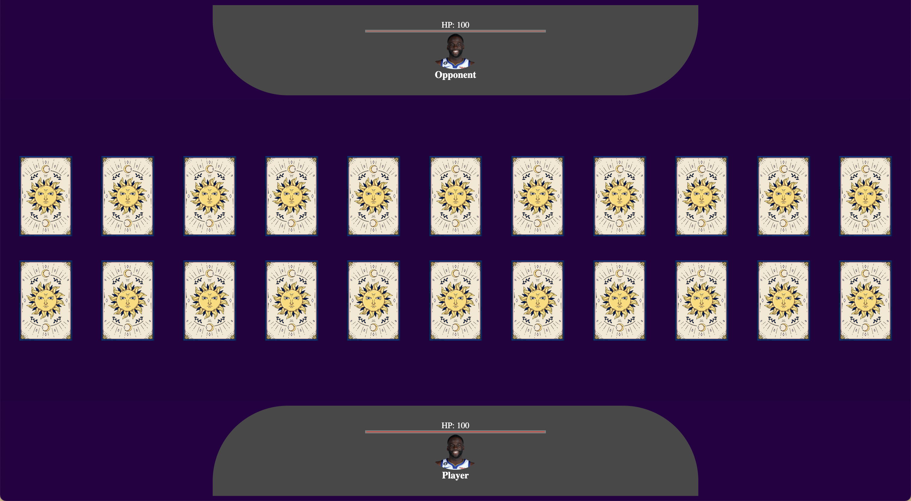
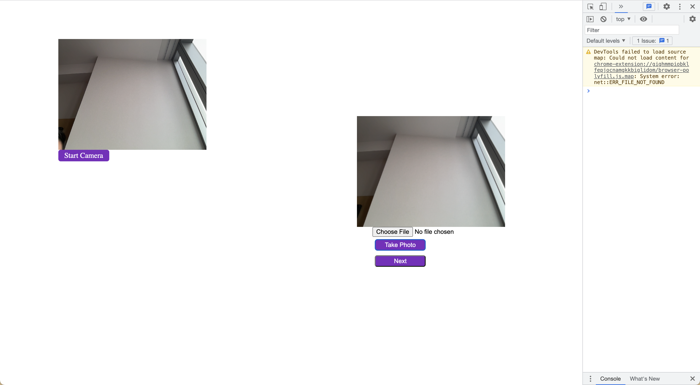
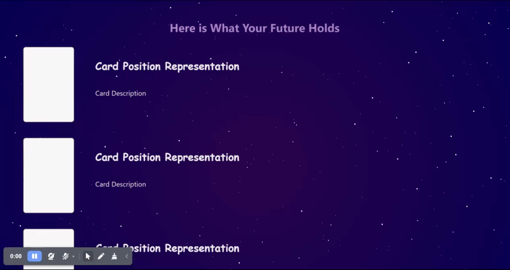
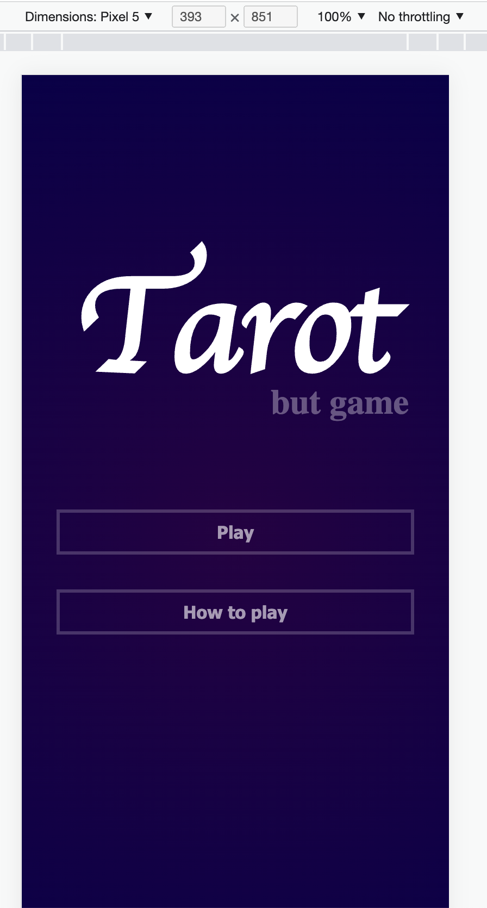
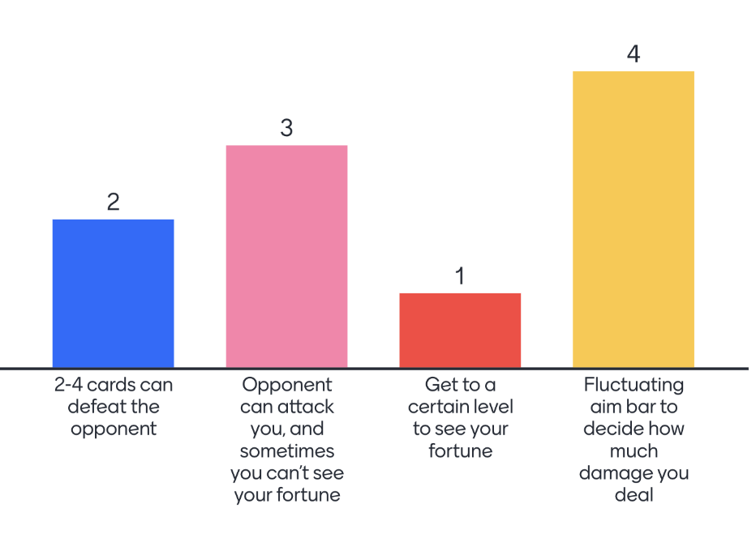

# Team Meeting

## Opening 
**Team** : 17 (CSS Crusaders)  
**Type** : Sprint Review   
**Location** : In person, right after class  
**Time** : Tuesday 6:30 - 7:30  
**Attendance**: 
- [x] Mick
- [x] Jenny
- [x] Kristine
- [x] Kevin
- [X] Maryam (online)
- [x] Henry
- [x] Steven
- [x] Ben
- [x] Ziyou (James)
- [x] Jeannie 

---
## Announcement:
1. We need to create more CI/CD pipeline components
2. Set up branch protection
3. Do not use GH website to merge PRs
   
## Agenda
1. Sprint Review
2. Git Branches
3. CICD
4. Game-ifying the app more
5. Subteam meetings

---

## Details

### Sprint Review
1. Mick
    - CI/CD pipeline
    - linter.yml and deploy_to_gh_pages.yml can be found in .github/workflows
    - Game Page to fit mobile screen
2. James 
    - UI Update on Game Page 
    - 
3. Backend Team -- Steven/Jeannie/Henry/Jenny 
    - camera.html
    - camera.html now has an option to open a camera or a user can upload their own image file.
    - Either taken or uploaded image will be shown on the game page
    - 
4. Jenny
    - ADRs 
    - Can be found in specs/adrs/
5. Kevin
    - Working on game instructions
    - Please send over tips on how to make it concrete
6. Maryam/Kristin 
    - Mobile and web results pages update
    - Added CSS animation of moving stars in the background
    - 
7. Ben
    - Welcome page(index.js) now fits mobile resolution
    - 

### Git branches
1. Main
    - protected/locked
    - Can’t edit to main at all
    - Can be only be merged by pull request from dev branch
    - Will only be open after class Tuesday to merge with dev
2. Dev
    - Seen as the “second main branch” 
    - Can push to dev if it is a hotfix or small fixes
    - Need at least 2 approval to merge 
    - Create feature branches and merge to dev
3. CI/CD
    - Need 3 more to help on CICD
    - ESLint/superlinter - Kevin
    - JSDocs - Mick
    - Some form of testing - Jenny
4. Game-ifying the game play more
    - 2-4 cards can defeat the opponent
    - Opponent can attack you, and sometimes you can’t see your fortune
    - Get to a certain level to see
    - Fluctuating aim bar to decide how much damage you deal
    - 

---
## Questions

---
## Conclusion 
1. When a player clicks a card, there will be a progress bar in range 25-50. Whatever the user stops at will be their damage points. They will keep choosing until they defeat the opponent. Based on this logic, users will be able to choose 2-4 cards and receive their fortune accordingly. 

### To do before next meeting

### What to do in next meeting 
