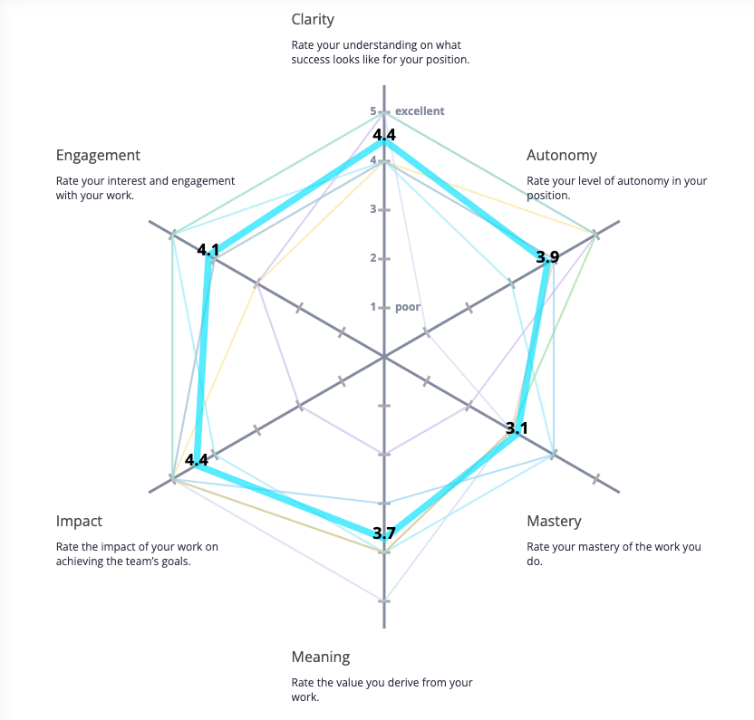
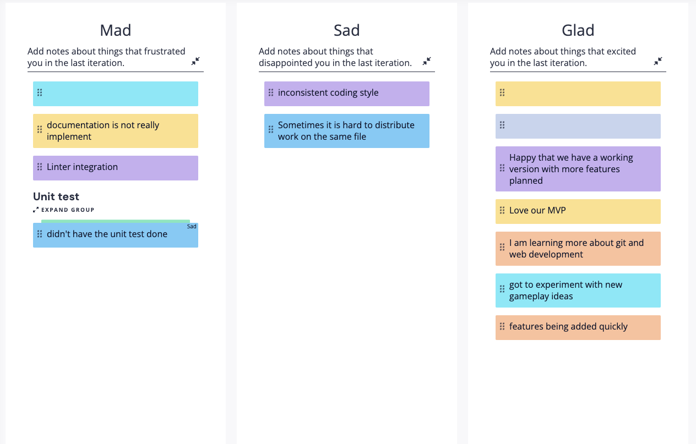

# Sprint Retrospective

## Opening 
**Team** : 17 (CSS Crusaders)  
**Type** : Sprint Retrospective   
**Location** : In person, right after class  
**Time** : May 28, Sunday, 4:00 - 4:45 pm  
**Attendance**: 
- [x] Mick
- [x] Jenny
- [x] Kristine
- [x] Kevin
- [ ] Maryam
- [x] Henry
- [x] Steven
- [x] Ben
- [ ] Ziyou (James)
- [x] Jeannie 

## Details

### How happy are you at work?

How can we improve Mastery?
1. Had to use a lot of outside resources for testing framework. Need thorough investigation to perfect it.
2. Sometimes, CSS can be hard to deal with. We should checkout code examples and read MDN documentations to perfect it.
   
How can we improve Meaning?
1. We can improve meaning of our project by adding a Game-ifying component to the game play.
2. WIP: User clicks on a card to select a damage from a progress bar, and result in different number of cards every game.

### Sad Mad Glad

- What went well: 
  - experiement with merge/PR techniques -> settled on feature branching
  - We have an MVP on Github pages since version 1.0
- What went bad:
  - Need for linter 
  - Need naming convention
  - Documentation

Top 3
1. Working on Unit Testing
   1. Currently on a feature branch
2. Need to work on more documentation
3. Inconsistent coding style
   1. First order of business on Tuesday's meeting

---
## Questions

---
## Conclusion 
- Overall, team is doing well and on track, but still need to improve on CICD and the game feature.

### To do before next meeting

### What to do in next meeting 