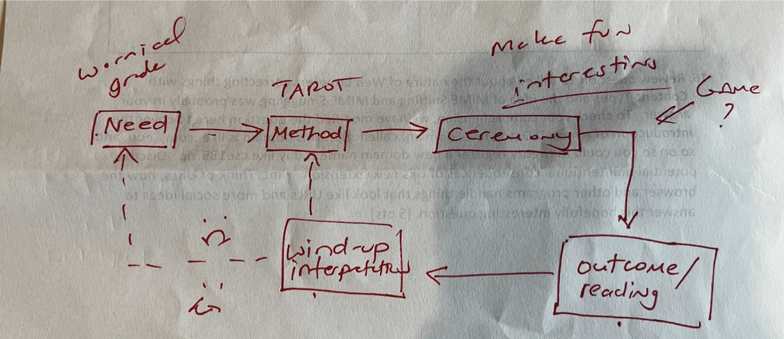

# Sprint Retrospective

## Opening 
**Team** : 17 (CSS Crusaders)  
**Type** : Sprint Retrospective   
**Location** : In person, right after class  
**Time** : May 28, Sunday, 4:00 - 4:45 pm  
**Attendance**: 
- [x] Mick
- [x] Jenny
- [x] Kristine
- [x] Kevin
- [x] Maryam
- [x] Henry
- [x] Steven
- [x] Ben
- [x] Ziyou (James)
- [x] Jeannie 

## Details

### Notes from Professor Powell

- Good:
  - Good job de-risking through code-pen
  - Good that we are making ceremony interesting 
- Bad:
  - Lacking in need and user satisfication "I want to know my fortune"
  - While its a game, you should definitely make it more interesting. Think about how a person can get better at this game? (don't make a pure randomness game)
  - What is the outcome of our game?
    - Example from Powell
    - If the game is :
    - Opponent attacks you with a card
    - You have to choose a card to deflect it and attck the opponent (Ex: Life beat Death)
    - Then the outcome is leaning what cards are complements of each other. In other words, the end user will learn more about tarot cards
    - The outcome is different from fortune telling/wind-up interpretation
  - Instead of prompting the user to take a picture, have a preset of character and their images 
  - Might want to increase friction (more interaction) in the game play by adding sound effect
  - From Akshay: change in margin in result page

### Team Status Video
- 4 mins or less video 
- present status of our software
- function of our pipeline
- health of our team 
- Challenges we are facing (may have been revealed in retrospective)
- Preview about what the next sprint will tackle/what to look forward to

### Backend Notes
- Put everything in init (?)
- User power/luck point instead of opponent hp
- For Mick, Steven, Henry, Jenny, Be : 
  - Need to fix the import json since it is failing prettier and many other function
  - Solution: switch from json to tarot.js

---
## Questions

---
## Conclusion 
- Switch gameplay implementation 

### To do before next meeting
- Need to decide on new implement of game play and assigned people to work on it immediately!

### What to do in next meeting 